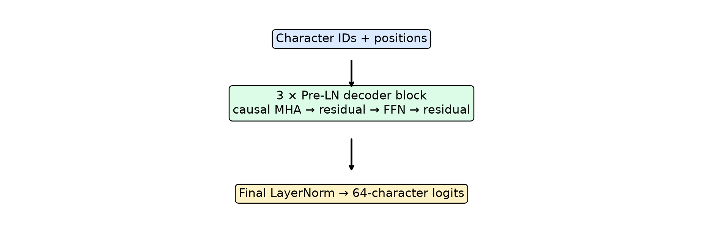
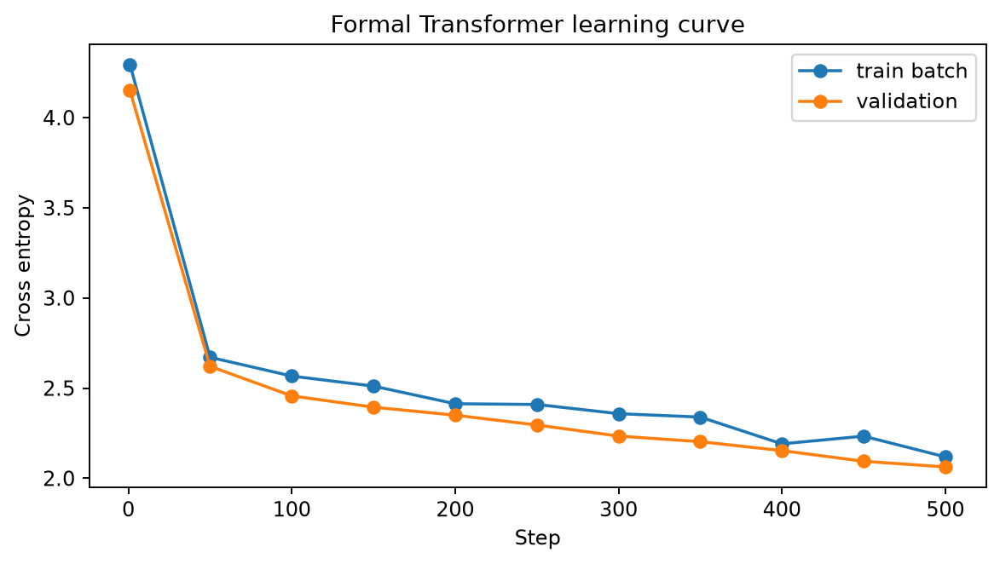
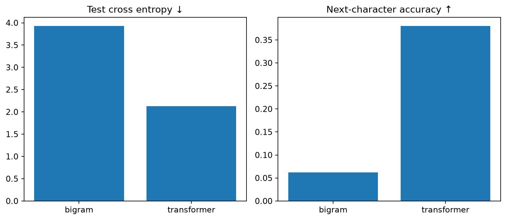
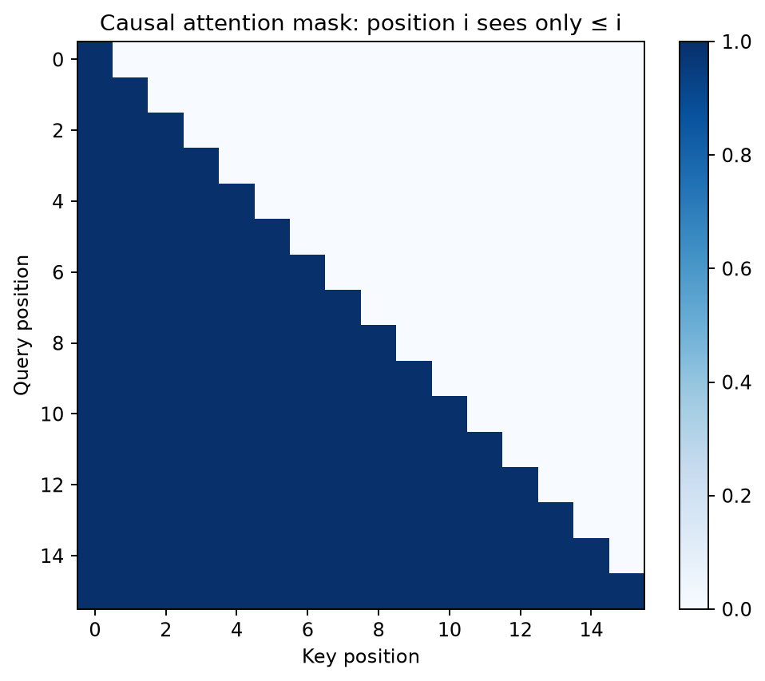
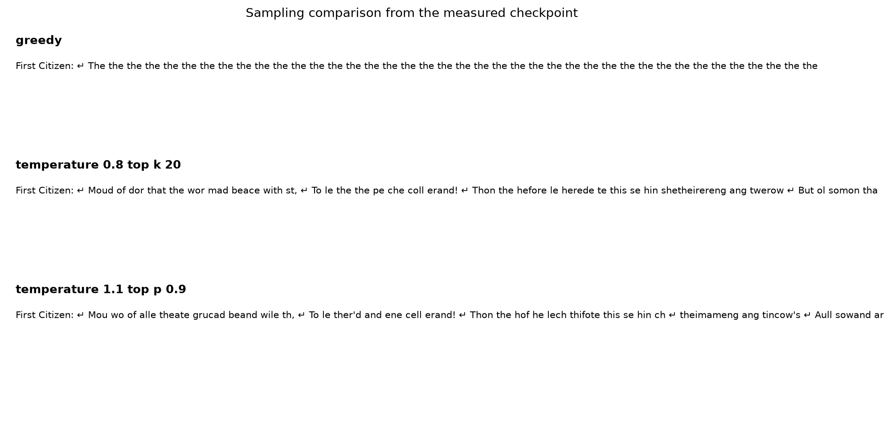
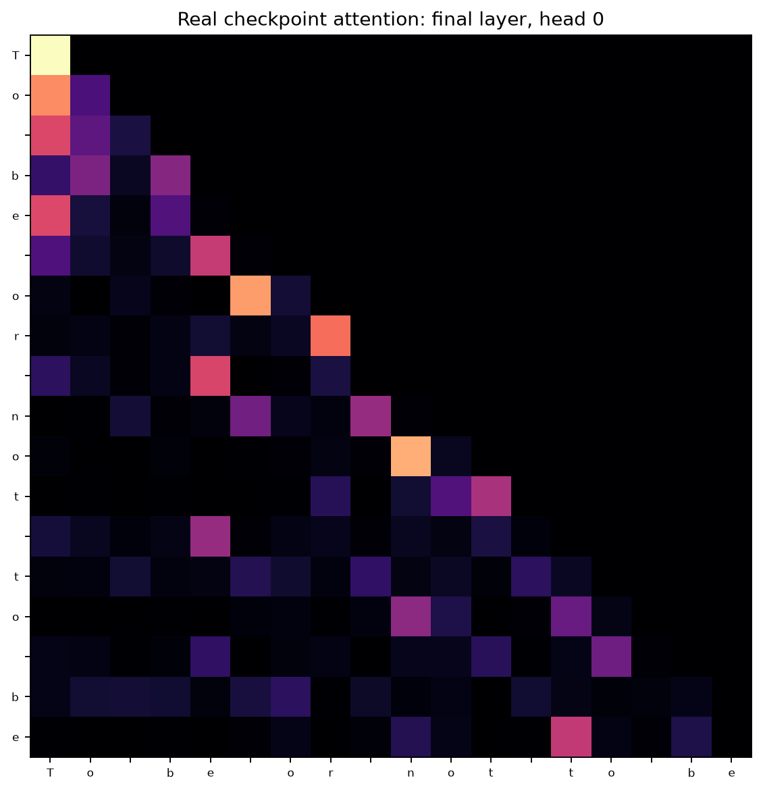

# Transformer Language Model Lab：从零构建因果字符语言模型

[English](README.md)

这是一个从基础 PyTorch 模块实现的 decoder-only 因果 Transformer 实验平台，覆盖字符 Tokenizer、Causal Multi-Head Self-Attention、连续语料切分、可复现训练、留出集评估、受控生成和 Attention 可视化。



## 实测结果

正式实验为 CPU、seed 42、完整 1,115,394 字符 Shakespeare 公版来源。Tokenizer 只在 train 拟合；1,024 个固定 validation target 选择 checkpoint，完整 held-out 每个 target 只计一次。

| 模型 | Test CE ↓ | 字符 PPL ↓ | BPC ↓ | 下一字符准确率 ↑ | 参数量 | 训练时间 |
|---|---:|---:|---:|---:|---:|---:|
| Count Bigram（alpha 0.5） | 2.4904 | 12.0655 | 3.5928 | 27.07% | 4,225 计数 | 确定性 |
| Causal Transformer | **2.1991** | **9.0173** | **3.1727** | **35.65%** | 357,473 | 85.33 秒 |

字符级 perplexity 依赖 tokenizer，不能与 GPT/LLaMA 等 subword 模型横向比较。




## 为什么做这个项目

原教学实验完成了 Transformer API 和字符预测入门；进一步审计发现，shifted labels 与未遮罩的 `TransformerEncoder` 组合会让位置看到包含答案的未来输入，造成 train/inference mismatch。新项目把核心改成真正的自回归 decoder，并用自动测试证明修复。

## 为什么因果遮罩重要

位置 `t` 对所有 `>t` 的 attention score 在 softmax 前设为负无穷，因此只能读取当前及历史 token。



`test_future_tokens_cannot_change_past_logits` 修改序列后缀并断言前缀 logits 不变；另一项测试断言 attention 上三角权重严格为零。这比“代码里写了 mask”更能证明因果约束。

## 数据、训练与制品

- 来源：[char-rnn tiny Shakespeare transcription](https://github.com/karpathy/char-rnn/tree/master/data/tinyshakespeare)
- 原作品：William Shakespeare，公版
- 规范化：LF 换行，完整 1,115,394 字符来源
- SHA-256：`86c4e6aa9db7c042ec79f339dcb96d42b0075e16b8fc2e86bf0ca57e2dc565ed`
- 字符词表：65，只在 train 拟合
- 先按连续位置切 90%/5%/5%，再各自建滑动窗口，避免相邻重叠窗口跨集合

模型由 token/position embedding、3 个 Pre-LN decoder block、final LayerNorm 和 LM head 构成。每个 block 自行实现 Q/K/V、scaled dot-product、causal mask、多头拼接、残差和 GELU FFN。训练采用 AdamW、mini-batch、梯度裁剪、周期验证和 best/last checkpoint。

Checkpoint 保存模型/优化器状态、模型配置、词表、step、loss、seed 和 corpus hash，可由新进程独立恢复与生成。

## 生成与 Attention Explorer

支持 greedy、temperature、top-k、top-p 以及固定 seed 复现。Streamlit 包含双语生成页、下一字符概率、可选 layer/head 热力图和实验仪表板。




## 快速开始

```powershell
pip install -e ".[dev]"
python -m scripts.prepare_data
python -m scripts.experiment --model transformer --config configs/small.yaml --corpus data/formal_corpus.txt --output checkpoints
python -m scripts.build_reports
streamlit run app/streamlit_app.py
```

## 测试与 CI

本机实测：26 项 pytest 通过，Ruff 通过。GitHub Actions 在 Python 3.10/3.11/3.12 执行 Ruff、pytest，以及 tiny train → checkpoint 保存/重载 → 短文本生成。CI smoke 只证明工程链未断，不等于正式语言模型实验。

## 局限

这是一次 CPU、单 seed 的小型字符模型，不是通用 LLM；没有 subword tokenizer、广泛知识、指令微调、安全对齐或生产服务 SLA。单 seed 不能报告 mean±std，生成文本可能不连贯，attention heatmap 也不等同于因果解释。
